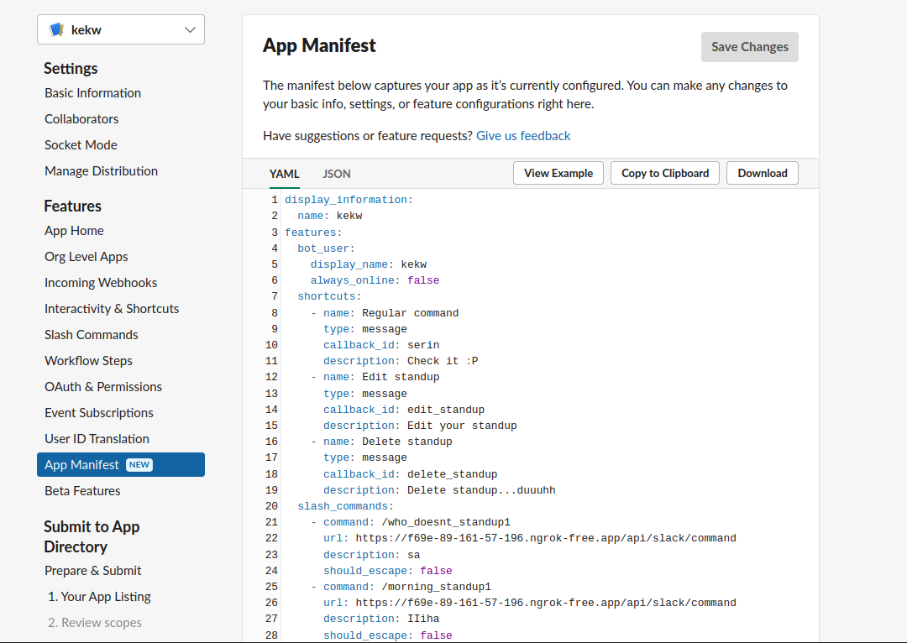

<h1 style="justify-content: center; display:grid; color:purple;">Wstaniobot</h1>

# Instrukcja użytkownika

## Komendy:
- ### morning_standup 
- ### evening_standup 
- ### who_doesnt_standup
- ### excusal
- ### help
 
## Morning standup
poranny standup ( <b>/morning_standup</b> ) - plany do wykonania w ciągu dnia. Powinno
na nie krótkimi zwięzłymi słowami odpowiadać, ale pole tekstowe obsługuje też duże
ilości tekstu. Dodatkowo jeżeli po oddaniu porannego standupu ktoś będzie chciał go
poprawić, należy ponownie wpisać tę komendę. Wyświetlą się wtedy pola, które
ostatnio wypełniliśmy z możliwością ich edycji.
-  4 pytań
1. Jakie zadania na dziś planujesz oraz jak oceniasz czas ich
wykonania ?
2. Jakie widzisz zagrożenia i blockery w powyższej liście ?
3. Czy w któryms z powyższych tematów chciałbyś otrzymać pomoc ?
4. Czy w którymś z planowanych zadań przyjąłbyś kompana do Pair
programmingu / konsultacji / podzielenia się wiedzą
doświadczeniami ?
- pola do zaznaczenia, czy pragniemy dołączyć do kogoś do wspólnego
programowania
- przyciski opcji, umożliwiające określenie miejsce pobytu podczas
wykonywania deklarowanych czynności (zdalnie, stacjonarnie)
- opcjonalnie, już przy samej edycji standupu, na samej górze formularza
pojawią się przyciski opcji, umożliwiające wybór między usunięciem
wiadomości w celu edycji lub edytowaniu jej (jedna z tych akcji jest
wymagana, by nie mnożyć wiadomości odnośnie jednego standupu).
## Evening Standup
wieczorny standup ( <b>/evening_standup</b> ) - opis wykonanych czynności w ciągu dnia.
Powinno na nie krótkimi zwięzłymi słowami odpowiadać, ale pole tekstowe obsługuje
też duże ilości tekstu. Na standup składa się z:
- 5 pytań
1. Co udało ci sie dzisiaj skończyć ?
2. Które zadań nie zostały zakończone i na jakim etapie dzisiaj je
pozostawiasz ? (pamiętałeś żeby wypchnąć je do repo ?)
3. Pojawiły się jakieś blockery ?
4. Czego nowego się dziś nauczyłeś / dowiedziałeś ? A jeśli niczego to
czego w danym temacie chciałbyś się +dowiedzieć ? Daj nam sobie
pomóc
5. Tutaj wrzuć swoje tickety/pry oraz czas ich wykonania - spokojnie,
opcjonalne
- opcjonalnie, już przy samej edycji standupu, na samej górze formularza
  pojawią się przyciski opcji, umożliwiające wybór między usunięciem
  wiadomości w celu edycji lub edytowaniu jej
##Who Doesnt Standup
Kto nie dał standupu ( <b>/who_doesnt_standup</b> ) - wylistowane uczestników z danego
kanału, na który został zaproszony bot, w celu pokazania kto i jaki standup
zaprezentował. Dana komenda umożliwia też sprawdzenie, kto zwolnił się z dania
standupu. Zawiera ona możliwość sprawdzenia, w jakiej dacie ktoś oddał standup, można
wybrać od jakiego standupu zacząć wyświetlanie (gdy zdecydujemy przeglądać tę
komendę po cichu - tylko w wiadomościach przeznaczonych dla nas) - prywatnie lub np. by kogoś postraszyć, że jeszcze nie wyspowiadał się z tego, co będzie robił
podczas dnia, wystawić publiczną notkę na temat tego, kto nie oddał standupu
## Excusal
zwolnienie ze standupu ( <b>/excusal </b> ) - możliwość usprawiedliwienia się z nieoddania
standupu, gdy ktoś sprawdzający standupy jest bardziej restrykcyjny (szef, manager,
nawet kolega z pracy)
Są dwie możliwości: dodanie zwolnienia oraz przeglądanie zwolnień z możliwością
usunięcia
Po wybraniu opcji dodaj zwolnienie pojawi się kilka opcji:

❖ Data zakończenia zwolnienia

❖ Osoba której dotyczy zwolnienie - można wybrać kogoś innego niż osoba zgłaszająca

❖ Powód zwolnienia

Po zaakceptowaniu zwolnienia, zostanie ono zapisane w bazie danych i
będzie można je dowolnie przeglądać z poziomu przeglądania zwolnień z drugiej
opcji komendy <b>/excusal</b>.

Po wylistowaniu jest możliwe przeglądanie zwolnień - id, imię, data od kiedy, data
do kiedy, jaki jest powód - tylko 10 na raz w celu skalowania wyświetlanych wartości.
Dodatkowo jest możliwość wybrania id zwolnienia w celu jego usunięcia, oczywiście
opcjonalnie.
##Help
pomoc (<b> /help </b> ) - możliwość sprawdzenia możliwych pytań na poranny oraz
wieczorny standup oraz możliwość sprawdzenia istniejących w bocie komend.
## Rzeczy, które mogą się przydać:
Podpięcie bazy danych do irb

(w moim wypadku tylko dwie klasy-
pewnie da sie lepiej, ale znalazłem tylko takie rozwiązanie dla ruby'ego z rake'iem)
Możliwe jest przechodzenie między komendami, korzystając z intuicyjnych
przycisków znajdujących się pod spodem wyświetlanego tekstu, umożliwiające
szybkie i dynamiczne przełączanie się między stronami pomocy.


```ruby

`require 'active_record'
class Standup_Check < ActiveRecord::Base; end
# class Team < ActiveRecord::Base; end
db_config = YAML.load_file('config/postgresql.yml')
Standup_Check.establish_connection(db_config['development'])
Team.establish_connection(db_config['development'])
Team.connection
Standup_Check.connection`
```
or
```ruby
require_relative 'app'
```
## Testing

start server with command
```bash
RACK_ENV='test' foreman start
```
after completing tests, all tables will be wiped except teams, which tests simply needs 

# Instrukcja administracyjna
#### Tworzenie serwera testowego
Na start tworzymy serwer startowy (gdzie będziemy testować bota)

#### Tworzenie bota na app.slack.com
Na start tworzymy własnego bota na https://app.slack.com/
#### Kopiowanie envów
Robimy `cp .env.example .env` i wklejamy tokeny bota do .enva

#### Przygotowanie aplikacji do działania lokalnie

Warto w tym momencie 
`Bundle i`
Oczywiście `rake db:create db:migrate`

Pobierz ngrok.

Na dzień dzisiejszy uruchamia się go poprzez komendę `ngrok http 5000` (5000 to port foremana).
To głównie dlatego, że slack api potrzebuje https i po to jest ngrok.
Można użyć innego serwisu do tunelowania - pagekite też dawał radę.

Jednocześnie należy uruchomić serwer - `foreman start` 

I już mamy działający serwer i ngroka.

#### Weryfikacja endpointów bota
Gdy to wszystko mamy, kopiujemy tam app_manifesto.txt z zamienionymi wszystkie urle z tym wygenerowanym przez ngrok.
Klikamy zapisz.

Prawdopodobnie wyskoczy powiadomienie odnośnie event subscription. Klikamy click here to verify i powinno bez problemu przejść(oczyœiście cały podpunkt "Weryfikacja endpointów bota" robimy z działającym ngrokiem i serwerem).


#### Dodawanie bota lokalnie do serwera
Gdy to się potwierdzi, można dodać bota do sewera.

Wchodzimy w link wygenerowany przez ngroka (ewentualnie localhost:5000) i dodajemy bota do serwera (wszystko według kroków podanych na stronie z linku).


### Voila, powinno śmigać
